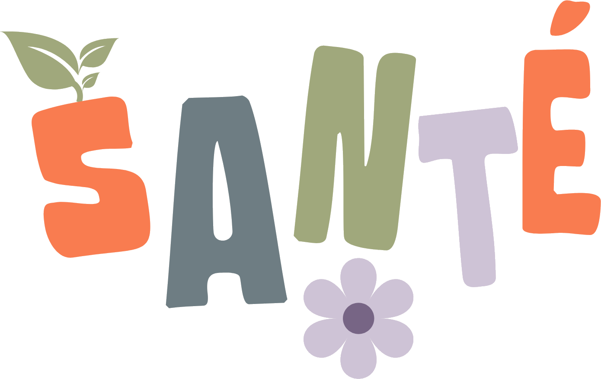
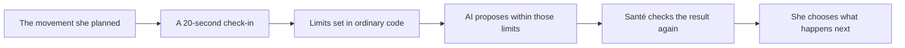

<div align="center">
  
  <h1>Santé</h1>
  <h3>Keep the goal. Change the route.</h3>
  <p><strong>A women’s wellness app that adapts movement to the day a woman is actually having.</strong></p>
  <p><a href="https://sante-chi.vercel.app/">Try the live demo</a> · Women’s wellness · Mobile-first · No wearable required</p>
  <p><sub>For the intended experience, open the demo on a phone.</sub></p>
</div>

---

## A changed day is not a failed day

We built Santé because most wellness plans quietly assume that tomorrow will feel like today.
Real life does not work that way. Energy changes. Pain changes. Mood changes. Sometimes the
room, the noise, or the number of decisions is simply too much.

Santé starts with the movement a woman already planned. She answers four short questions about
her energy, discomfort, mood and sensory load. The app then reshapes that plan within clear
limits, explains what changed, and leaves the final choice with her.

The goal is not to make every workout easier. The goal is to make the plan honest enough to
continue.

One of our teammates helped us understand this more clearly while we were building. On a
high-sensory-load day, our original before-and-after screen felt like another thing to get
through. It contained too much information at exactly the moment she had the least room for it.
That experience shaped **Calm mode** and **Simplify Today**: fewer choices, quieter presentation,
and one clear next action, without pretending that sensory load automatically tells us what her
body can physically do.

## See the idea in under a minute

1. Open the [live demo](https://sante-chi.vercel.app/) and choose **Try demo**.
2. Follow the short welcome as Maya, our fictional demo user.
3. Open **Today** and check in, or choose **Everything feels like a lot right now**.
4. Watch the planned session change and read why it changed.
5. Start the session, swap a movement, or choose rest. All of them are valid outcomes.



## What it feels like to use

| Moment | What Santé does |
|---|---|
| **Before the session** | Shows what she planned, then asks how today feels. Every question also accepts “Not sure.” |
| **When capacity is low** | Offers a shorter or quieter route and makes the reason visible. |
| **When choosing is the hard part** | Simplify Today reduces the result to one recommendation and one action. |
| **During movement** | Shows one movement at a time, with an optional timer, written guidance and curated demonstrations where we have verified one. |
| **When something is not working** | Swaps the movement without restarting or making the session longer. |
| **Afterwards** | Asks whether the session was too much, just right, or could have been more. Santé only remembers a suggested preference after she agrees. |
| **Across the week** | Treats rest as a real day, and can suggest moving a longer session instead of quietly dropping it. |

## Why AI belongs here

We did not use AI to decide whether someone is safe to exercise. We did not ask it to diagnose
why she feels different. We use it for the part that benefits from judgment and language:
rebuilding an existing session inside limits the application has already decided.

The order matters:

1. A red-flag check runs before the model. If someone reports chest pain, fainting, severe or
   unusual pain, or a possible pregnancy complication, Santé stops. No session is generated.
2. Ordinary code calculates the maximum intensity, target duration, maximum number of movements
   and anything that must be excluded.
3. GPT-5.6 Luna may only choose from movements that already satisfy those limits.
4. The proposed session is checked again before the user sees it.
5. If the model is slow, unavailable, or returns something invalid, Santé builds a deterministic
   fallback plan instead and says so honestly.

**The AI can work inside the boundary. It cannot widen it.**

## What is in the prototype

- A guided demo and replayable three-step product tour
- A four-part readiness check-in with honest uncertain answers
- AI-assisted adaptation with streamed, real process steps
- Intent-first workout discovery and selected-workout adaptation
- Twenty-three complete sessions across gentle movement, mobility, strength, recovery and
  low-sensory options
- A one-movement-at-a-time player with optional timers and live swaps
- Curated movement demonstrations from health and physiotherapy sources where verified
- Calm mode and the temporary Simplify Today experience
- Weekly planning, rest days and rebalance suggestions
- Progress history and descriptive patterns based on the user’s own entries
- Feedback memory that asks permission before changing a preference
- Supabase authentication, Postgres persistence and row-level data isolation

## What Santé deliberately does not claim

Santé is a wellness product, not a medical one. It does not diagnose, treat, prevent injury,
or replace a health professional. It does not infer a condition from someone’s check-in.

Cycle and symptom history, plus supporting context from Apple Health and Samsung Health, are
roadmap ideas only. They are not live integrations. If we build them, what the woman reports
today will remain more important than a calendar prediction or device observation.

## Privacy in plain language

Each user has an isolated identity. Check-ins and history are protected with Supabase Row Level
Security, so the database itself enforces who may read a row. The browser cannot write the
safety verdict, and identity comes from the authenticated session rather than a user ID sent in
the request body.

## Built with

- **Product:** Next.js 14, React 18, TypeScript and Tailwind CSS
- **Data and identity:** Supabase Auth, Postgres and Row Level Security
- **Adaptation:** OpenAI Responses API with GPT-5.6 Luna, structured output and tool calling
- **Validation:** Zod contracts plus deterministic constraint checks
- **Delivery:** Server-sent events for visible adaptation steps, deployed on Vercel

## The team

| Person | What they brought to Santé |
|---|---|
| **Amazing Man** | Product direction, frontend experience, the AI adaptation system, integration and end-to-end QA |
| **Serene** | Supabase architecture, database migrations, persistence, authentication security and Row Level Security |
| **Dua** | Brand direction, visual storytelling, animation style and demo video production |
| **Jue** | Product story, research, team coordination and the hackathon submission |

We worked across those lines when the product needed it. The table describes ownership, not four
separate projects.

## Run it locally

```bash
npm install
cp .env.example .env.local
npm run dev
```

Add the Supabase and OpenAI environment values described in `.env.example`. The deterministic
adaptation path can still build a session without an OpenAI key, but the complete authenticated
product expects Supabase to be configured.

## Writing about Santé

We want the submission and social posts to sound like the people who built the product. Jue’s
short editing guide, the facts that must stay accurate, and ready-to-adapt social copy are in
[the team writing and social guide](docs/JUE_WRITING_AND_SOCIAL_GUIDE.md).

---

<div align="center">
  <strong>A changed day is not a failed one.</strong><br />
  The plan changes. The intention does not.
</div>
